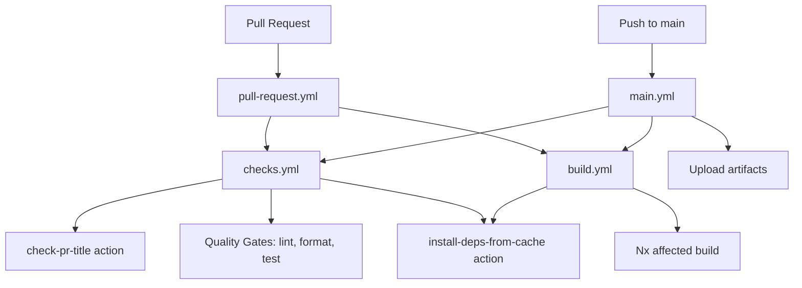

# GitHub Actions Workflows & Actions

This directory contains the CI/CD automation for the repository, including workflows for pull request validation and main branch deployment.

## 📁 Automation Structure

```
.github/
├── workflows/          # GitHub Actions workflows
│   ├── main.yml            # Main branch pipeline
│   ├── pull-request.yml    # PR validation pipeline
│   ├── checks.yml          # Reusable quality gates
│   └── build.yml           # Reusable build workflow
└── actions/            # Custom composite actions
    ├── check-pr-title/
    │   └── action.yml      # PR title validation
    └── install-deps-from-cache/
        └── action.yml      # Dependency installation with caching
```

## 🔄 Workflows

### Entry Point Workflows

| File                   | Trigger        | Description                                                   |
| ---------------------- | -------------- | ------------------------------------------------------------- |
| **`main.yml`**         | Push to `main` | Main branch pipeline - runs checks, builds, uploads artifacts |
| **`pull-request.yml`** | PR events      | PR validation - checks + builds on PR open/update             |

### Reusable Workflows

| File             | Called By                  | Purpose                                               |
| ---------------- | -------------------------- | ----------------------------------------------------- |
| **`checks.yml`** | main.yml, pull-request.yml | Quality gates: linting, formatting, tests, compliance |
| **`build.yml`**  | main.yml, pull-request.yml | Build affected projects, optional artifact upload     |

## 🎯 Custom GitHub Actions

### `check-pr-title` Action

**Location:** `.github/actions/check-pr-title/action.yml`

Validates pull request titles against conventional commit format:

- **Pattern:** `type(number): description`
- **Allowed Types:** feat, fix, docs, test, ci, chore
- **Requires:** JIRA work item number in parentheses
- **Example:** `feat(123): add user authentication`

**Validation Rules:**

- Type must be one of the allowed types
- Must include JIRA work item number in parentheses: `(123)`
- Description must start with a letter
- Provides detailed error messages for failed validation

### `install-deps-from-cache` Action

**Location:** `.github/actions/install-deps-from-cache/action.yml`

Installs Node.js dependencies with caching optimization:

- **Inputs:** `node_version`, `pnpm_version`
- **Features:** pnpm setup, Node.js setup with cache, dependency installation
- **Used By:** All workflow builds for consistent dependency management

## ⚙️ Required Repository Variables

Both workflows reference these repository variables:

- **`NODE_VERSION`** - Node.js version for builds
- **`PNPM_VERSION`** - pnpm version for package management

## 🔧 Workflow Details

### `main.yml` - Main Branch Pipeline

**Trigger:** Push to `main`
**Jobs:**

1. **Configuration** - Shows Node.js and pnpm versions
2. **Checks** - Calls checks.yml (no PR title check, compliance scans disabled)
3. **Build** - Calls build.yml with artifact upload enabled
4. **Summary** - Reports results

### `pull-request.yml` - PR Validation

**Trigger:** PR opened, edited, synchronize, reopened, ready_for_review
**Jobs:**

1. **Configuration** - Shows versions
2. **Checks** - Calls checks.yml (includes PR title validation, compliance scans disabled)
3. **Build** - Calls build.yml (no artifact upload)
4. **Summary** - Reports results

### `checks.yml` - Reusable Quality Gates

**Type:** Reusable workflow
**Configurable Inputs:**

- `pr_title` - PR title for validation
- `run_pr_title_check` - Enable/disable title validation
- `run_linting` - Enable/disable linting
- `run_formatting` - Enable/disable format checking
- `run_unit_tests` - Enable/disable unit tests
- `run_compliance_scans` - Enable/disable security scans

**Uses Actions:**

- Custom `check-pr-title` action for PR validation
- Custom `install-deps-from-cache` action for setup
- `nrwl/nx-set-shas@v4` for affected project detection

### `build.yml` - Build & Artifact Management

**Type:** Reusable workflow  
**Input:** `upload_build_artifacts` (boolean)
**Features:**

- Nx affected project detection
- Build affected projects only
- Optional artifact upload (retention: 30 days)

## Workflow Flow


